# Fine-Tuning LlamaFactory with the llamafactory-sft Skill


This tutorial-style Notebook shows how to use the `llamafactory-sft` skill to let an agent assist with a LlamaFactory SFT fine-tuning workflow. It does not explain every training parameter in depth. Instead, it demonstrates how the skill breaks one fine-tuning task into confirmable, traceable, and reproducible steps.

This tutorial uses a lightweight example: starting from a Qwen3.5-2B model, using built-in LlamaFactory datasets to run a LoRA SFT job, then validating the result and exporting the model after training.

## 1. Environment Setup

Hardware and software environment for this tutorial. This tutorial is run on an AMD Radeon W7900, and the same steps also apply to Nvidia GPUs.

| Item | Configuration |
|---|---|
| GPU | AMD Radeon PRO W7900 |
| ROCm | `7.2.1` |
| Agent | Cursor |

First, install LlamaFactory:

```bash
git clone --depth 1 https://github.com/hiyouga/LlamaFactory.git
cd LlamaFactory
pip install -e .
pip install -r requirements/metrics.txt
```

Check whether the installation succeeded:

```bash
llamafactory-cli version
```

If LlamaFactory version information is printed, the environment is ready.

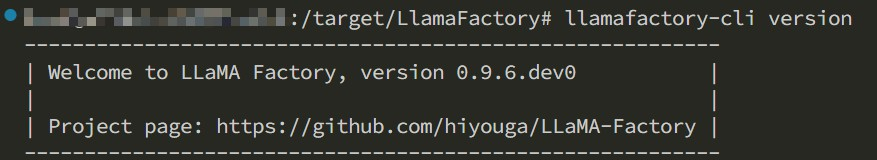


This tutorial assumes that you have already opened the LlamaFactory repository in an agent environment that supports skills. The `llamafactory-sft` skill is located at:

```bash
.claude/skills/llamafactory-sft/SKILL.md
```

## 2. Starting the Task

When the user asks for something like "use LlamaFactory to do SFT / fine-tuning / train a LoRA", the agent enters the workflow defined by this skill. In addition to natural-language triggering, the skill can also be invoked explicitly in agents that support command-style invocation. The explicit invocation syntax may vary between agents. The examples below are only format examples; use the syntax supported by your current agent environment.


There are several ways to trigger the skill. You can describe the task directly in natural language, or invoke it explicitly:

```text
# Explicit invocation syntax varies by agent; these are only common format examples.
/llamafactory-sft  # Agents such as Claude Code that support slash commands
$llamafactory-sft  # Agents such as Codex that support $SkillName triggers
```

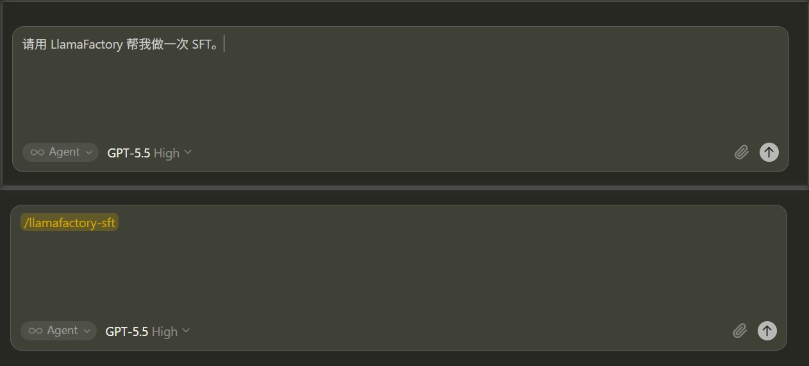


Now give the agent a natural-language task. A simple description is enough; the skill will continue by asking you to confirm details such as the model, dataset, execution mode, and fine-tuning type:

```text
Please use LlamaFactory to help me run an SFT job.
```

You can also be more specific from the beginning:

```text
Please use LlamaFactory to help me run a LoRA SFT job.
Use Qwen3.5-2B as the model, and use identity and alpaca_zh_demo as the initial datasets.
Use the full CLI workflow: training, validation, and export.
```

The skill's first step is not to write configuration immediately, but to confirm the overall shape of this experiment.

## 3. Stage 0: Confirm the Overall Workflow

The agent confirms three key branches at once:

| Question | Choice in This Tutorial |
|---|---|
| Workflow scope | Full flow: training, validation, export |
| Execution mode | CLI |
| Fine-tuning type | LoRA |


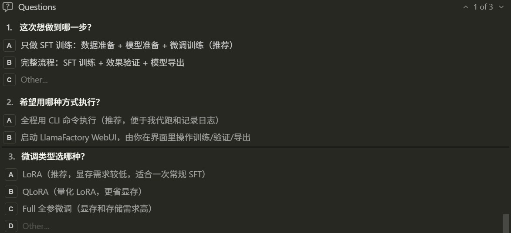


> If the user initially says only "Please use LlamaFactory to help me run an SFT job", the skill will fill in these details here and during the later steps instead of choosing defaults silently. This means that even if the user has not specified the model, dataset, CLI/WebUI route, or LoRA/Full/QLoRA mode in advance, the agent will confirm the key branches clearly through interaction.

After confirmation, the agent displays a progress board at the top of each subsequent reply:

```text
Progress Board
[x] 0. Confirm the overall workflow
[~] 1. Data preparation
[ ] 2. Model preparation
[ ] 3. Fine-tuning configuration
[ ] 4. SFT training
[ ] 5. Result validation
[ ] 6. Model export
```

This board is a practical constraint built into the skill. Training tasks often take a long time, and the process may include model downloads, parameter confirmation, log polling, export, and other steps. The board lets the user always know where the workflow currently is.


### 3.1 Branch One: SFT Only vs. Full Flow

If **SFT only** is selected in Stage 0, the skill only completes data preparation, model preparation, fine-tuning configuration, and training. After training finishes, it tells you where the checkpoint, logs, and loss curve are located, then ends the workflow.


If **Full flow** is selected, as in this tutorial, the skill continues after training by generating `infer.yaml`, running a validation script, and generating export configuration according to whether the run is LoRA, QLoRA, or Full fine-tuning. The main path used later in this tutorial is Full flow.

### 3.2 Branch Two: If WebUI Is Selected

If **WebUI** is selected in Stage 0, the skill does not continue by generating a CLI training yaml file and starting training automatically. Instead, it first completes data, model, and GPU preparation, then starts the LlamaFactory WebUI:

```bash
llamafactory-cli webui
```

If it is running on a remote server, the skill prompts you to use SSH port forwarding, for example:

```bash
ssh -L 7860:localhost:7860 user@remote_host
```

Then open the following URL in a local browser:

```text
http://localhost:7860
```

In the WebUI route, training, validation, and export are mainly completed by the user through the interface. The skill's role becomes "organizing the confirmed information into WebUI field suggestions", for example:

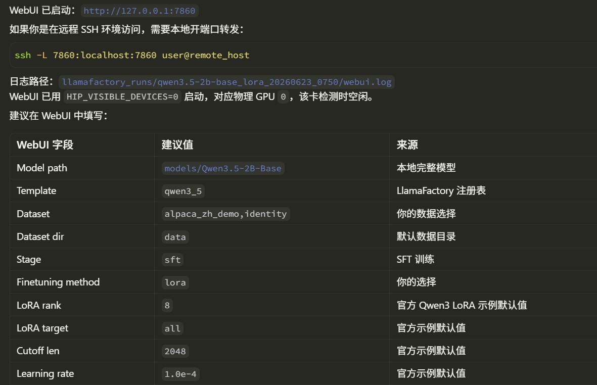


In other words, the WebUI branch is better suited for users who want to adjust parameters through the interface and observe training curves visually. The CLI branch is better suited for users who want the agent to execute the whole process, record it, and poll training status.


## 4. Stage 1: Prepare the Dataset
This tutorial uses CLI execution because it is easier to explain.

For the dataset, this tutorial uses built-in LlamaFactory datasets:

```yaml
dataset: identity,alpaca_zh_demo
```
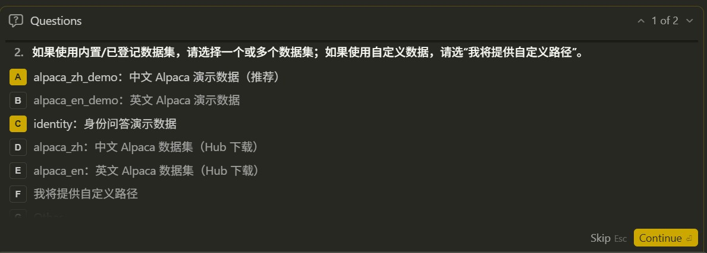


The agent reads `data/dataset_info.json` and confirms that these datasets already exist. For datasets such as `identity` that contain template variables, the skill reminds the agent to ask whether variables such as `{{name}}` and `{{author}}` should be replaced, instead of directly using the default placeholders.

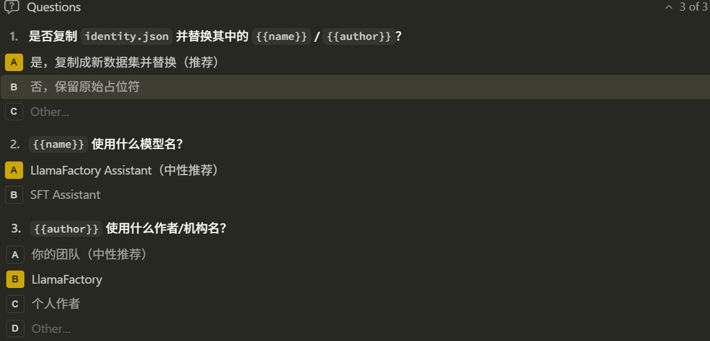

If you choose to replace the template variables in `identity`, the agent writes the replaced data into a new data file, such as `data/identity_custom.json`, and adds a corresponding entry to `dataset_info.json`, for example registering it as `identity_custom`. The original `identity` file is not overwritten, and LlamaFactory's built-in datasets are not polluted. The actual filename can be adjusted according to the experiment name.


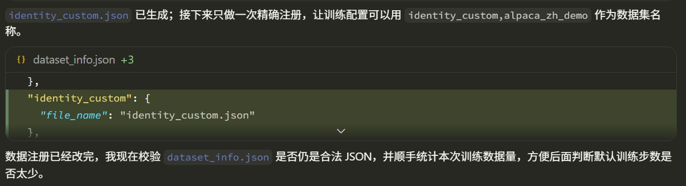


> If we choose custom data, the skill requires the agent to check the data format first. Common LlamaFactory text SFT data formats include Alpaca and ShareGPT.
>
> Alpaca example:
>
> ```json
> {
>   "instruction": "Who are you?",
>   "input": "",
>   "output": "I am an assistant fine-tuned with LlamaFactory."
> }
> ```
>
> ShareGPT example:
>
> ```json
> {
>   "conversations": [
>     { "from": "human", "value": "Who are you?" },
>     { "from": "gpt", "value": "I am an assistant fine-tuned with LlamaFactory." }
>   ]
> }
> ```
>
> If the data does not meet the requirements, the skill asks the agent to get the user's consent first, then writes a new converted file. It does not overwrite the user's original data in place, and it does not arbitrarily pollute LlamaFactory's built-in `data/*.json` files.

## 5. Stage 2: Prepare the Model

This tutorial uses the Qwen3.5-2B model:

The skill requires the agent to first confirm model support and the default template from LlamaFactory's own model registry, instead of guessing from experience. The relevant information is in:

```bash
src/llamafactory/extras/constants.py
src/llamafactory/data/template.py
```

For Qwen3 models, the agent matches the corresponding model family and template, then selects the closest official example yaml file, such as:

```bash
examples/train_lora/qwen3_lora_sft.yaml
```

Next, the agent checks whether a complete local model already exists. If the model does not exist or the cache is incomplete, it asks which download source to use:

| Download Source | Description |
|---|---|
| Hugging Face Hub | Xet acceleration can be used |
| ModelScope | Usually more stable in mainland China network environments |
| Let the agent decide | Automatically choose based on network connectivity |

After a download source is selected and the download starts, the agent monitors the download speed. If the download is slow, it asks the user whether to switch to another source.


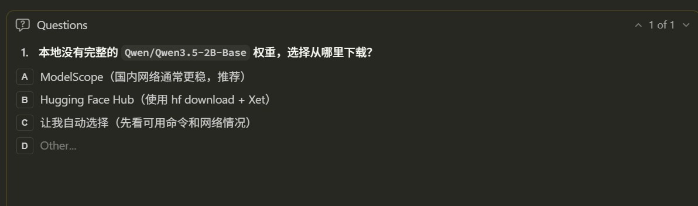


## 6. Stage 2.5: Select GPU

Before training, the skill has the agent detect GPUs (AMD and Nvidia GPUs are both supported):

```bash
amd-smi monitor 2>/dev/null || rocm-smi 2>/dev/null || nvidia-smi
```

If only one GPU is idle, the agent uses it directly. If multiple GPUs are idle, the agent asks whether to use a single GPU or multiple GPUs.

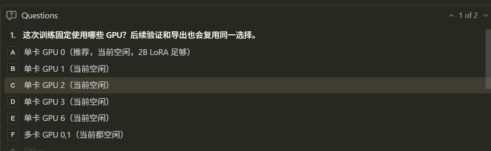

Training, validation, and export then reuse the same GPU selection. For example:

ROCm environment:

```bash
HIP_VISIBLE_DEVICES=0 llamafactory-cli train llamafactory_runs/qwen3.5-2b-base_lora_20260623_0619/sft.yaml
```

NVIDIA environment:

```bash
CUDA_VISIBLE_DEVICES=0 llamafactory-cli train llamafactory_runs/qwen3.5-2b-base_lora_20260623_0619/sft.yaml
```


This step avoids a common problem: training uses one GPU, but validation or export re-detects GPUs and ends up running on another busy GPU.


## 7. Stage 3: Generate the Training Configuration

After entering the CLI route, the skill has the agent start from an official example configuration and change as few parameters as possible.


Before writing the yaml file, the agent first displays a table of key parameters:

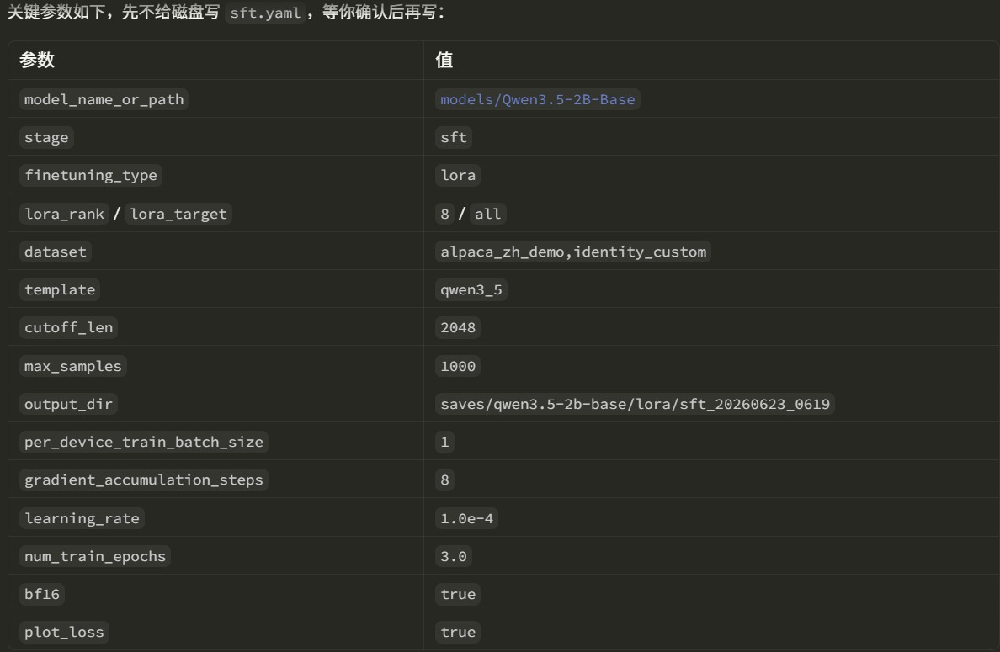


If some parameters differ from the official example, the agent also displays a diff table:

The user can customize the parameters they want to modify. For example, we change `template` to `qwen3_nothink`.

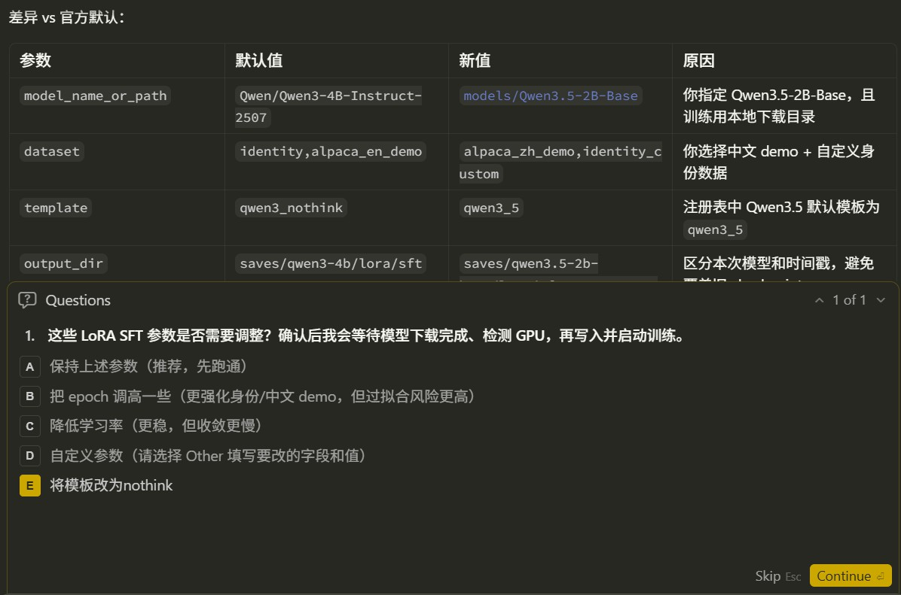

Only after the user confirms does the agent write the configuration into a specific directory. This directory is dedicated to the configuration and logs for this experiment, preventing them from being mixed together with model weights and checkpoints.


## 8. Stage 4: Start Training and Track Loss

After the training configuration is confirmed, the agent starts training in the background:

```bash
HIP_VISIBLE_DEVICES=0 llamafactory-cli train "llamafactory_runs/qwen3.5-2b-base_lora_20260623_0619/sft.yaml" > "llamafactory_runs/qwen3.5-2b-base_lora_20260623_0619/train.log" 2>&1
```

After startup, the agent continues polling the real training process and logs.

Example status report:

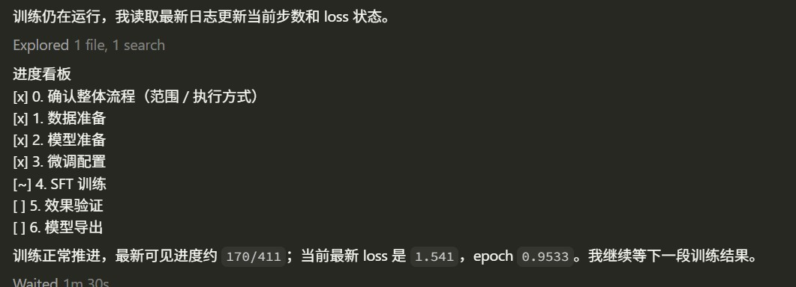


After training finishes, the agent reports some basic training information. LlamaFactory generates a loss curve in the output directory, which can be used to inspect the training loss.


## 9. Stage 5: Validate Fine-Tuning Results

The full workflow continues into the result validation stage. For LoRA fine-tuning, the inference configuration needs to include both the base model and the adapter:

The agent references the official example configuration, generates the corresponding yaml file, displays it, and waits for user confirmation.

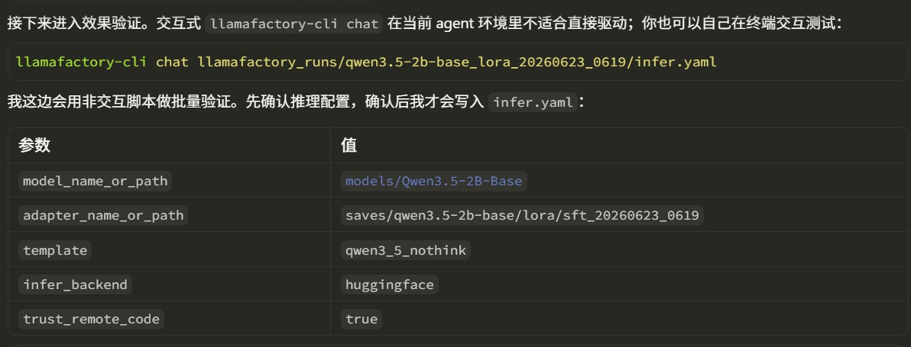


In an agent environment, interactive `llamafactory-cli chat` is usually inconvenient to drive automatically. Therefore, the skill generates a non-interactive script for result validation. The validation query is specified by the user.

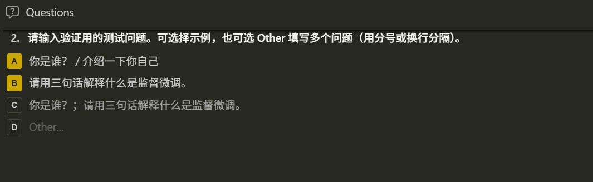


If the user wants to test interactively, they can run the `llamafactory-cli` command themselves. The skill displays the exact command to the user, who only needs to copy it into a terminal for testing.


## 10. Stage 6: Export the Model

The export flow for LoRA / QLoRA merges the adapter into the base model, producing a model directory that can be loaded independently.

The agent asks for the export directory configuration.
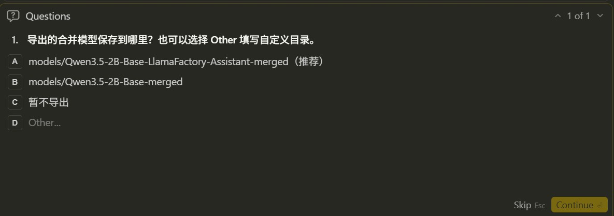

Based on the example and the output name specified by the user, the agent generates the export yaml file. An example is shown below:
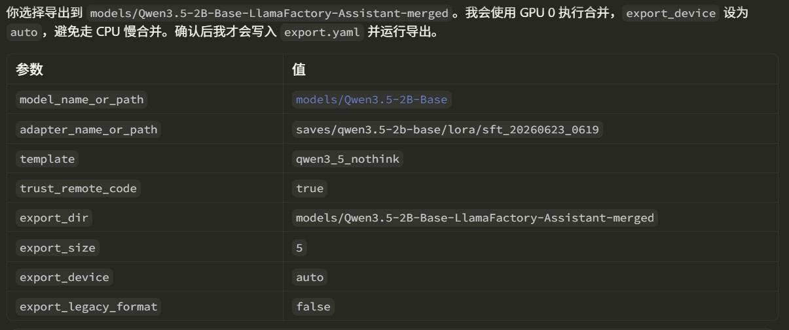


The final model is saved to the corresponding directory.


For Full fine-tuning, there is no adapter and no merge step. The skill requires the agent to point `model_name_or_path` directly to the training output directory, and recommends exporting to a directory such as `models/<base_model>-sft`.


## 11. What a Complete Run Produces

After the full run in this tutorial finishes, you usually get the following files and directories, subject to the actual agent prompts:


- `llamafactory_runs/...` stores the configuration and logs for this experiment.
- `saves/...` stores the trained LoRA adapter and loss curve.
- `models/...-merged` stores the complete merged and exported model.


## 12. Summary

This tutorial demonstrates how to use the `llamafactory-sft` skill to let an agent carry out SFT intelligently. With this skill, users do not need to remember every detail at once. They only need to describe the goal in natural language, and the agent can move through a clearly structured fine-tuning experiment stage by stage. For users who are just starting with LlamaFactory, it lowers the barrier to running SFT successfully for the first time. For experienced users, it also reduces the time spent repeatedly checking configuration details.
